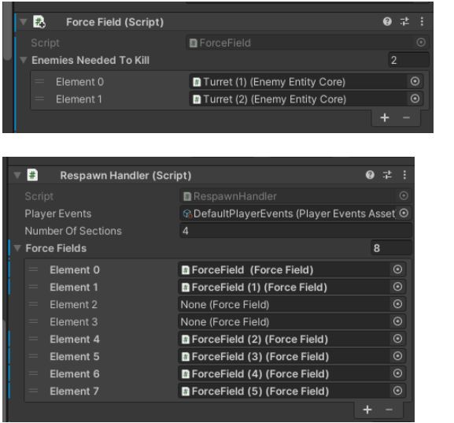

# Game Basic Information #

## Summary ##

Our protagonist, the player, begins their journey within virtual space. 
We do not know how they got here or how they were created. 
Yet, we understand one thing, their entity is trapped in this digital landscape and they must resist this elusive environment to survive.  
This realm, while mimicking reality, is a hostile environment, surrounded by various obstacles that the player must unravel. 
It is in a sense, a digital prison from which must you escape. 
As the player, you must attempt to break out of this landscape paralleling the reality of a modern, yet futuristic city.
As you traverse through the area, you must creatively move to get through obstacles blocking your path kill the enemies along your path to get to the end.

Overall, the idea of the game is a 3D platformer game involving many different mechanics for the player to traverse through the landscape. The objective of the game is to traverse through the level and reach the end. 

They can reach the end through various movement mechanics such as wallriding, dashing, sliding in order to avoid obstacles along the way.
They can kill enemies along their path by dashing against them in order to get through to the next stage of levels. There are 5 levels in total. Once they reach the end of level 5, they complete the game. 

## Gameplay Explanation ##

### Introduction: 
Our core gameplay mechanic is staged around movement. We intended to include various unique movements that help the traversal through the level. The core gameplay focuses on physics and the game states the trigger based upon specific movement events throughout the game. 

### Main Movement Input: 
- For our core movement, we designed it with similar inputs seen in most 3D games of moving the character, left, right, backward, and forward. 
- **WASD** controls the movement in this game. 
- By **moving the mouse**, we can interact with the camera (which looks specifically at the player). Moving the mouse left or right respectively will interact with the camera rotation around the player. 

### Sliding: 
- By moving and pressing **SHIFT**, the player can slide in this game. By sliding the player can lower their height and be under and obstacles along the path. 

### WallRunning: 
- We designed our level with the intention of wall running being our main movement for traversal. 
- By holding the forward or **W** key and having a wall next to you will cause the player to wall ride on the wall. 
- Pressing the **jump key** or **spacebar** and while wall riding will cause the player to detach from the wall and trigger a wall jump. 
- A wall jump is exactly as intended, it is a jump from a wall. 

### Dashing: 
- Dashing is a charging mechanic. It is done with two steps. 
- By **left clicking** or using the Fire1 button, the player charges his/her dash attack. Once charged, the player will give a visual and audio indicator. 
- Once the player has given the visual/audio indicator, it specifies the player has charged their dashing mechanic. 
- Once charged, the player has around 0.5 seconds to dash against the target. 
- If the player is not target locked towards an enemy, the player with dash a short distance. 
- If the player is target locked towards an enemy, the player will dash at a longer distance through the enemy itself. 

### The Level: 

#### Platforms: 
- Mainly the platforms serve as a way for the player to stand on. They act as terrain for the player to traverse through. 
- Platforms can either be buildings, flat platforms, or ramps. 

#### Hazards: 
- Indicated by their red wall glow, hazards are screens that kill the player if they come into contact with it. It is best to avoid these. 
- These act as obstacles that you have to avoid.

#### Walls: 
- Walls acts as terrain for the player to wall ride. These are placed throughout the map for the player to traverse through. 
- Walls can be just horizontal walls or cylinder walls. Both can wall ride. 

#### Force Field 
- Force fields are placed at sections to prevent the player from going into the next section of the map. In order to break through them.
- In order to break through them, the player must kill the turrets at their respective sections of the map. 

### Enemies (Turrets): 
- Turrets are placed throught the map. They act as enemies and will shoot projectiles towards the player. If the projectile hit the player, they will die. 
- When the player comes into range of the turret, it will start shooting at the player. 
- When the player becomes close to the turret, the turret will slow down it's fire rate to balance changes. 
- If the player dashes through the turret, the turret will be killed. 

# Main Roles #

### Summary of what people have done: 

- Arthur - Movement and Input, Modeling, Animations, Audio 
- Brandon - Movement and Input, UI, Game Logic 
- Peng - Level Design, Gameplay Trailer, Gameplay Testing 
- Simon - Particle System, Press Kit 
- Tyler - Enemy AI / Turrets, Game Feel

These are generally what people have done the most. As there weren't any designated roles mainly, it is just what people worked on the most. 

## User Interface

*Design of Main Menu* - The main menu design was pretty simple. It features a with a title and some general simple buttons. I was able to download some fonts for the UI and it turned out pretty good. 
For the colors I mainly used a simple gradient accent and also made a simple procedural background generation. Brandon handled the main user interface system - **Peng** 

## Movement/Physics

Using Wallrunning.cs, PlayerWallGlideState.cs, and PlayerAirborneState.cs, I implemented wallrunning, one of the game's biggest technical challenges. 

The implementation uses raycasts to detect the nearest wall that's not only marked as "Terrain"
but also verifies various other checks like it's angle of rotation. Once connected, the wallrunning state will move you alongside the wall adding to your velocity.

- Implementation mildly was based on a Unity Prototype Series but was largely changed to fit our needs and to incorporate within our Hierarchical State Machine: [State Machine](https://www.youtube.com/watch?v=qOVtucXxb1E&t=278s&ab_channel=Unity)
- **Brandon** 

Also worked on Wall Jumping which sends the player in the Vector3.up() + wall Normal direction with an Impulse Force. Code within Wallrunning.cs as well.

Using PlayerLandingState.cs I implemented rolling, a consequence to falling with a velocity past a certain threshold. The state gets rid of your control for a brief moment of time and plays a rolling animation. - **Brandon** 

## Input / System 

## Level Design / Visuals 

### Level Design 
- *Creating Levels*: Creating the levels, I started with a simple scene that was particular large. Our initial process was that we were going to create one huge level to play on with full of details. However that eventually got scrapped for something else. Therefore we instead transition to a approach that included levels for everything. THe player would transition from one level to another So far we have created 5 levels from 1 to 5 in sequence. - **Peng**

- *Buildings*: The main asthetic of the game comes from the buildings that you see along the outside. They were made with probuilder, simple shapes, and simple emission maps that I made using a image editing software called GIMP. Although I created various prefabs, not all of them were used. In fact most of them were scrapped for better things. I had to adjust the UVs on the probuilder for most of the prefabs so they would fall in line with the asthetic. Mainly the top building's UV needed to be adjusted to fit in line. - **Peng**

- *Platforms*: Most of the platforms were created the same way using an emmission map and probuilder. They were simple to implement. Platforms included the simple wall in which you can traverse through, a cylinder which you can traverse around, and buildings which act similarly to platforms but fit with the asthetic. - **Peng**

- *JumpPads*: I created a simple jump along with its script. If the player makes contact with the jump pad their velocity would be immediately set to zero and then launched with a set velocity force right after. That way, I could control the velocity at which the player is launched. - **Peng**

- *SkyBox*: I created materials for these using unity's 3D skybox. I had initially set up a shader graph for these but it didn't work. Therefore Arthur suggested a simple solution of using a texture map which I implemented. I downloaded a skybox starry night texture online and added it to images then made a material for it. The source can be found here: [3D Skybox](https://tools.wwwtyro.net/space-3d/index.html#animationSpeed=1&fov=80&nebulae=true&pointStars=true&resolution=1024&seed=5j8g40cfqgg0&stars=true&sun=true) - **Peng**

- *Level1Implementation*:  Level 1 implementation was considered to be a simple level in which it mainly teaches the player wallriding as a main skill. It was suppose to be a simple scene, but since the jump from level 1 to level 2 was too far in terms of skill, Arthur added some more hazards and an enemy along the way. - **Peng**

- *Level2Implementation*:  Level 2 was mainly implemented with the design that the player would learn to do complex wall riding movements as well as being able to kill the enemies as well. Mainly Arthur added the hazards but I did most of the intial platform placements. However through various iterations it did get changed. - **Peng** 

- *Level3Implementation*: Level 3 is height traversal map. I placed the platforms with the intention that the player will traverse through them and gain height over time. The platforms reach a peak and then fall back down. I added hazards along the way to guide the player in a specific direction - **Peng** 

- *Level4Implementation*: Level 4 is mainly teaching about the player to traverse through the cylinders. It was mainly implemented with the intention as a warm-up map to level 5. Additionally, there were many hazards along the way forcing the player to slide in order to get through the map. - **Peng** 

- *Level5Implementation*: Level 5 is implemented with the intention of using jumpads and sliding as a main mechanic. It was definitely one of the more time consuming maps to implement but overall it was well worth it for the last level. It was implemented for the player to utilize the complex movements. For example, one mechanic is that you gain speed while you slide. Therefore, I intentionally created large ramps for the player to slide along. I had initially set up the platforms and jump pads but afterwards Brandon added the hazards for the map. - **Peng** 

## Modeling/Particles 

- Modeling the player was done in blender and we kept it simple with the player having a very simplified body, that was covered in clothing. Player is textured using Unity. This was done by Arthur - **Simon**

- For the particle effects we aimed to keep it simple so we used simple shapes for each of the player particles. The particles are meant to compliment the visuals of the player with cube shaped particles for the players movement through the world. Triangle plane particles are used mainly for combated related particles such as the turrets bullet emitting triangle particles in a 360 circle around it. The player's weapon emits particles when charging up and helps visualize when the weapon is ready to be used while charging. Tyler created the triangle particles while I created the cube ones - **Simon**

## Game Logic

- *AI/Enemies* Created the AI system where the turrets activate when the player is within range, will rotate towards the player and fire at the player once the player is within the turrets sight. There were other AI systems like walking about randomly but since Nav Meshes had to be baked into the level and only I knew how to bake them, it was cut to give the level designers more freedom. Also worked at balancing the turrets to make them a bit easier to defeat. [FULL 3D Enemy Video ](https://www.youtube.com/watch?v=UjkSFoLxesw&ab_channel=Dave%2FGameDevelopment) used this to help make the turrets AI, though it was basics and I had to heavily adapt it for our purposes. The only one thing still in its original form mostly is the call to look at the player. - **Tyler**

- Created the checkpoint system via Checkpoint.cs where each checkpoint has an ID that corresponds with what should and shouldn’t be respawned at death. This allowed enemies to be respawned when you have yet to reach the next checkpoint. Integrated with the event system to decouple code. - **Brandon**

- Created the ForceField.cs and RespawnHandler.cs logic which holds data on the specific enemies that need to be killed in order for the force field to open. This was important as the main character was required to eliminate these machines in their path to escaping this decaying digital world. RespawnHandler holds an array which holds an array of enemies. When respawning, RespawnHandler indexes to the specific group of enemies needed depending on the checkpoint ID the player is at. - **Brandon**

- Created the PlayerSpawn.cs, PlayerExit.cs, and SceneLoader.cs logic which loaded/unloaded levels additively as the player progressed through the game. This enabled our core functionality to remain present in its own scene at all times. The player triggers these scripts through a trigger collider which in return loads the next scene specified, resets the player’s velocity, and moves them to the next spawn. - **Brandon**

# Sub-Roles

## Audio

## Gameplay Testing

Went through the gameplay testing sheet to remove irrelevant or impossible questions for remote testing. Helped keep the team on schedule to facilitate gameplay testing in a timely manner. - **Tyler** 

For the gameplaytesting, I did it groups of around 2-3 people. But overall, I was able to get through to 10 people overall. I was able to fill out questionaire sheets by group. Therefore the response are in terms of the group and not overall individuals. They mainly categorize as group responses rather than individual responses. Generally, people either responded individually or people that responded as a group. I put all the responses in bullet format. There were certain questions that the group felt was reduntant so I decided to remove those questions in the questionire. Therefore, the questionaire only contains questions that they have answered not ones that they felt were confusing at times. - **Peng** 

[Group1Responses](https://docs.google.com/document/d/1XpPOGWuCIeT6rdigkR_PWpnXJ5en4mKr/edit?usp=sharing&ouid=115636314873656894616&rtpof=true&sd=true)

[Group2Responses](https://docs.google.com/document/d/1Tni4BqhFXaVqJ3iiDGAkGbh8zy5ejpmI/edit?usp=sharing&ouid=115636314873656894616&rtpof=true&sd=true)

## Narrative Design

Overall there was not much narrative design elements in this game. Mainly for a 3D platformer game, there isn't much narrative design elements to implement. 
For the narrative design elements, I mainly made the background to fit the theme of what we were going for. I designed this process in which the character is in an alternate realm in whiich it is a 3D futuristic city full of neon lights. Mainly the background asthetic was that I wanted the player to feel like they were trapped in an alternate dimension and they had to escape the land. Therefore, by traversing through the end, it would get harder and harder. The player should feel fustration while playing but eventually want to get to the end and complete the game. The levels are short but also difficult. Once the player completes the game, they would feel like the escaped the world but they get a NUll reference exception error to troll them. Therefore, they haven't actually escaped. - **Peng** 

## Press Kit and Trailer

### Gameplay Trailer

For the gameplay trailer, I had initially designed it as a montage of gameplay using my favorite song. I believed that a montage of gameplay served better as a way to introduce a game. I believed this served better purpose rather than I would play the game on the editor, record on OBS and then edit the scenes together. I would just simply try to sync the cutscenes with the song itself. It was very simply implemented - **Peng** 

[Link to Trailer](https://www.youtube.com/watch?v=P1dlvfSensU&ab_channel=SaltMeister)

### Press Kit 

We showcased our work by demonstrating the focus of our game: speed and mobility. The trailer video does just that by demonstrating the player's quick movement around the map and the execution of the satisfying clean cut when the player dashes into an enemy. - **Simon** 

The screenshots that we chose help demonstrate the gameplay with some images showcasing the player's design as well. - **Simon**

## Game Feel

For game feel, I mainly tested level testing during my level desing process. I would gameplay test for game feel while testing the levels. I mainly wanted to implement the levels as a way to allow the player to create different paths of traversal through the level. Therefore, I optimized for a feel of face pace movement that required high skill. - **Peng**

Played through the game myself to find bugs and balance issues. - **Tyler** 

